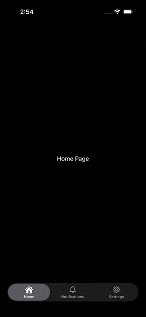

# AnimatedGlassTabs-UIKit
A UIKit iOS 26+ custom TabBar with liquid glass effect and animated tab icons.

[中文版 README](README_CN.md) | [SwiftUI Version](https://github.com/kai7win/AnimatedGlassTabs)

## Demo


## Features
- 🌟 **Liquid Glass Effect**: Beautiful liquid glassmorphism design for the tab bar using UISegmentedControl
- 🎨 **Animated Icons**: Smooth icon animations with scale and rotation effects using UIView keyframe animations
- ⚡ **UIKit Native**: Built entirely with UIKit and programmatic UI
- 🔧 **Customizable**: Easy to customize colors, animations, and tab items
- 📱 **iOS 26+ Compatible**: Uses the latest iOS features and design patterns

## Installation

### Requirements
- iOS 26.0+
- Swift 5.9+
- Xcode 26.1+

### Clone the Repository
```bash
git clone https://github.com/yourusername/AnimatedGlassTabs-UIKit.git
cd AnimatedGlassTabs-UIKit
```

## Usage

### Basic Implementation

```swift
import UIKit

class ViewController: UIViewController {
    let customTabBar = CustomTabBarView()
    
    private let homeVC = HomeViewController()
    private let notificationsVC = NotificationsViewController()
    private let settingsVC = SettingsVieController()
    
    private var currentVC: UIViewController?
    
    override func viewDidLoad() {
        super.viewDidLoad()
        view.backgroundColor = .systemBackground
        
        view.addSubview(customTabBar)
        customTabBar.translatesAutoresizingMaskIntoConstraints = false
        
        NSLayoutConstraint.activate([
            customTabBar.bottomAnchor.constraint(equalTo: view.safeAreaLayoutGuide.bottomAnchor, constant: -10),
            customTabBar.leadingAnchor.constraint(equalTo: view.leadingAnchor, constant: 20),
            customTabBar.trailingAnchor.constraint(equalTo: view.trailingAnchor, constant: -20),
            customTabBar.heightAnchor.constraint(equalToConstant: 50)
        ])
        
        customTabBar.onTabSelected = { [weak self] tab in
            self?.updateView(for: tab)
        }
        
        updateView(for: customTabBar.activeTab)
    }
}
```

### Custom Tab Definition

```swift
enum CustomTab: String, CaseIterable {
    case home = "Home"
    case notifications = "Notifications"
    case settings = "Settings"
    
    var symbol: String {
        switch self {
        case .home: return "house"
        case .notifications: return "bell"
        case .settings: return "gearshape"
        }
    }
    
    var selectedSymbol: String {
        switch self {
        case .home: return "house.fill"
        case .notifications: return "bell.fill"
        case .settings: return "gearshape.fill"
        }
    }
}
```

### Customization

```swift
// Customize tab bar colors
customTabBar.activeTint = .label
customTabBar.inActiveTint = .secondaryLabel
customTabBar.activeTab = .home

// Handle tab selection
customTabBar.onTabSelected = { tab in
    print("Selected tab: \(tab.rawValue)")
}
```

## Project Structure

```
AnimatedGlassTabs-UIKit/
├── AppDelegate.swift                    # App lifecycle
├── SceneDelegate.swift                  # Scene lifecycle
├── AnimatedTabBar/
│   └── CustomTabBarView.swift          # Custom tab bar with glass effect and animations
├── ViewControllers/
│   ├── ViewController.swift            # Main container view controller
│   ├── HomeViewController.swift        # Home page
│   ├── NotificationsViewController.swift # Notifications page
│   └── SettingsVieController.swift     # Settings page
├── Base.lproj/
│   ├── Main.storyboard                 # Main storyboard
│   └── LaunchScreen.storyboard         # Launch screen
└── Assets.xcassets/                    # App assets and icons
```

## Key Components

### CustomTabBarView
A custom UIView wrapping `UISegmentedControl` that provides:
- Glass effect styling with UISegmentedControl
- Custom tab item rendering with SF Symbols
- Smooth selection animations with callback support
- Dynamic image generation for tabs

### AnimationTabLayerView
An overlay view that handles icon animations:
- Scale and rotation animations
- Keyframe animation sequences
- Smooth transitions between tabs

### Animation System
- **Keyframe Animation**: Complex multi-stage animations using `UIView.animateKeyframes`
- **Scale Animation**: Icons scale from 0.8x to 1.2x and back to 1.0x
- **Rotation Animation**: Rotation effect combined with scale for dynamic feedback
- **Duration**: Total animation duration of 0.6 seconds with three distinct phases

## How It Works

1. **Tab Selection**: When a tab is tapped, the `UISegmentedControl` triggers the selection callback
2. **View Controller Switching**: The main `ViewController` removes the current child view controller and adds the new one
3. **Animation Trigger**: The `AnimationTabLayerView` performs keyframe animations on the selected tab icon
4. **Image Update**: Tab images are regenerated with appropriate colors and symbols
